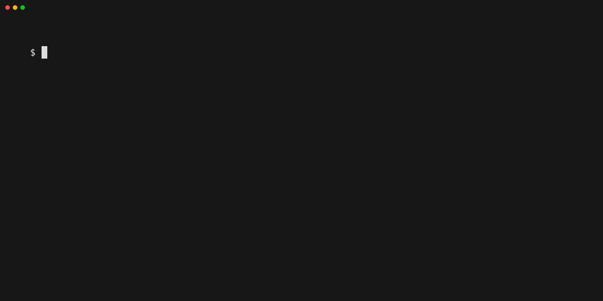

# pq is a cli to help manage podman quadlets

> [!NOTE]
> Uner Development

## Installation

To install `pq`, download the latest release from the [Releases page](https://github.com/rgolangh/pq/releases).
Make the binary executable (if necessary), and move it to a directory in your system's PATH, so it can be executed from anywhere.

**Example (Linux):**

```bash
curl -L -o - https://github.com/rgolangh/pq/releases/download/v0.0.5/pq_0.0.5_linux_amd64v3.tar.gz | tar -zxv
# Move it to a directory in your PATH (e.g., /usr/local/bin)
sudo mv pq /usr/local/bin/pq
```

## Usage

See how quadlets are stored in a git repository https://github.com/rgolangh/podman-quadlets.

This git repo is used by default. Override with `--repo https://my/git/repo`



```console
$ pq list
Listing quadlets from repo https://github.com/rgolangh/podman-quadlets (default in ~/.config/pq/pq.yaml)

- nginx
- redpanda
- wordpress

$ pq install wordpress
Installing quadlet "wordpress"
[#############             ]
Reload systemd daemon? [y/N] y
Reloading systemd daemon for the current user
Starting service wordpress.service for current user
Starting service wordpress-db.service for current user

$ pq install wordpress --repo https://github.com/rgolangh/podman-quadlets
Installing quadlet "wordpress" from https://github.com/rgolangh/podman-quadlets
[#############             ]
Reload systemd daemon? [y/N] y
Reloading systemd daemon for the current user
Starting service wordpress.service for current user
Starting service wordpress-db.service for current user

$ pq list --installed
- wordpress (on 24/01/2024)

$ pq remove wordpress
Stopping service wordpress-db.service for current user
Stopping service wordpress.service for current user
Remove quadlet "wordpress" from path /var/home/rgolan/.config/containers/systemd/wordpress?[y/n]y
removed "wordpress" from path /var/home/rgolan/.config/containers/systemd/wordpress
Reload systemd daemon? [y/N] y
Reloading systemd daemon for the current user

$ pq list-services
nextcloud - nextcloud-aio-master.service active (running)
redpanda - console.service inactive (dead)
redpanda - redpanda.service inactive (dead)

$ pq inspect nextcloud
Inspect quadlet "nextcloud"
# Source: https://github.com/rgolangh/podman-quadlets nextcloud/nextcloud-aio-master.container
[Unit]
...
# Source: https://github.com/rgolangh/podman-quadlets nextcloud/nextcloud-aio-master.volume
[Volume]
...

$ pq install --dry-run redpanda 
---redpanda-network-network.service---
...
```


